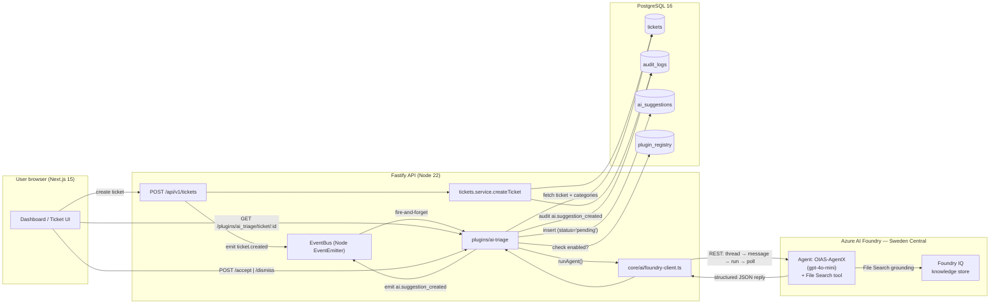

# OIAS Architecture — Microsoft Agents League Submission

**Track:** Reasoning Agents
**Microsoft IQ layer used:** Foundry IQ (Agent Service + File Search grounding)
**Primary AI platform:** Azure AI Foundry Agent Service

---

## High-level flow



---

## Reasoning chain inside the agent

The Foundry agent (`OIAS-AgentX`) executes **multi-step reasoning** on every ticket:

1. **Read** ticket title + description + the list of organisation-specific categories.
2. **Search** the Foundry IQ knowledge store (File Search tool) for resolved historical tickets that share keywords or category signals.
3. **Classify** category against the org's allowed list — null if no strong match.
4. **Score** priority using urgency lexicon (`down`, `outage`, `blocked`, `ASAP`) and de-escalation lexicon (`nice to have`, `cosmetic`, `when you get a chance`).
5. **Summarise** the issue into ≤100 words.
6. **Justify** the decisions in 1–2 sentences and emit a `confidence` in [0,1].
7. **Output** strict JSON conforming to the contract in `prompts/triage.md`.

The structured JSON is parsed by `core/ai/foundry-client.ts` and stored in `ai_suggestions.payload`. Every suggestion is persisted with `status='pending'` — **no AI output is auto-applied**; a human (admin/manager/agent) must POST `/accept` or `/dismiss`.

---

## Why this maps to judging criteria

| Criterion | Weight | How it scores |
|-----------|--------|---------------|
| Accuracy & Relevance | 20% | Foundry IQ grounds answers in real org ticket history rather than parametric knowledge — minimal hallucination. JSON contract enforces typed outputs (no free-form drift). |
| Reasoning & Multi-step | 20% | 7-step pipeline above (retrieve → classify → score → summarise → justify → confidence → emit). Each run produces a `reasoning` field stored alongside the decision. |
| Reliability & Safety | 20% | (a) `status='pending'` default — human-in-loop is enforced at the schema level. (b) Plugin failures are swallowed via try/catch — core ticket creation never blocks on AI. (c) Every AI write is mirrored in `audit_logs` with `threadId`/`runId` for full traceability back to the Foundry agent. (d) Org-scoped via `plugin_registry`; one tenant cannot trigger another's AI calls. |
| Creativity & Originality | 15% | Pluggable AI plane — `ai_triage` is one plugin in an extension architecture. Future plugins (`ai_reply_draft`, `ai_summary`, `ai_manager_brief`) reuse the same Foundry client, same audit trail, same accept/dismiss UX. Prompts are versioned under `/prompts/` and overlaid via `additional_instructions` rather than baked into TypeScript. |
| User Experience & Presentation | 15% | Suggestions surface inline on the ticket detail page with one-click Accept / Dismiss. Dashboard widget shows pending suggestion count for managers. |
| Community Vote | 10% | Public repo, MIT licence, demo video walks through both happy path and Foundry-down failure path. |

---

## Components touched

| File | Role |
|------|------|
| `apps/api/src/env.ts` | Adds `AZURE_AI_FOUNDRY_*` config block (all optional — graceful degradation). |
| `apps/api/src/core/ai/foundry-client.ts` | REST wrapper around the Foundry Agent Service: thread → message → run → poll → fetch → parse JSON. |
| `apps/api/src/plugins/ai-triage/index.ts` | `OIASPlugin` implementation. Listens to `ticket.created`, calls the agent, persists `ai_suggestions`, exposes `/health`, `/ticket/:id`, `/accept`, `/dismiss`. |
| `apps/api/src/plugin-loader.ts` | Registers `ai_triage` and calls `bindApp(app)` so event handlers can reach `app.db` / `app.log`. |
| `packages/db/src/seed.ts` | Inserts `plugin_registry` row enabling `ai_triage` for the Acme demo org. |
| `packages/types/src/audit.ts` | Adds `ai.suggestion_created` to the audit action enum. |
| `prompts/triage.md` | System prompt — pasted into the Foundry agent's "Instructions" field at agent creation. |

---

## Data path for one ticket

```
1. Operator clicks "New ticket" in the web UI.
2. POST /api/v1/tickets → tickets.service.createTicket
   - inserts row into `tickets`
   - inserts initial row into `ticket_status_history` ('new')
   - writes `audit_logs` row (action='ticket.created')
3. Route handler emits ticket.created on the in-process EventBus.
4. ai-triage plugin's handler runs asynchronously (fire-and-forget):
   a. Checks plugin_registry → confirms ai_triage enabled for this org.
   b. Loads the ticket and the org's active category names.
   c. Calls foundry-client.runAgent({ userMessage: JSON.stringify(...) }).
5. foundry-client:
   a. Resolves the agent's asst_ id (by name on first call; cached after).
   b. POST /threads → new thread.
   c. POST /threads/{tid}/messages with role='user'.
   d. POST /threads/{tid}/runs with assistant_id.
   e. Polls /threads/{tid}/runs/{rid} every 800ms until status='completed'
      (or fails/expires — max 60s wall clock).
   f. GET last assistant message → strips ```json fences → JSON.parse.
6. ai-triage plugin:
   a. INSERT ai_suggestions { status:'pending', payload: parsedJson, ... }
   b. auditLog action='ai.suggestion_created' with threadId/runId/durationMs.
   c. Emits ai.suggestion_created on the EventBus.
7. UI polls (or via SSE in a follow-up) /api/v1/plugins/ai_triage/ticket/:id.
8. Human accepts → POST /accept → ai_suggestions.status='accepted',
   ai.suggestion_accepted audit + event. Downstream listeners
   (e.g. auto-categoriser) can act on the accepted suggestion.
```

---

## Failure modes — and how we contain them

| Failure | Containment |
|---------|-------------|
| Foundry endpoint unreachable | `FoundryError` thrown, caught by the plugin's try/catch, logged. Ticket creation still succeeds. No `ai_suggestions` row written. |
| Agent run status = `failed` / `expired` | Same as above. The `last_error.message` from Foundry is logged. |
| Agent returns non-JSON output | `parsedJson === null`; we store `{ _raw: rawText }` so a human can still inspect. |
| Plugin disabled mid-run | `isEnabledForOrg` checked on every event — disables take effect immediately. |
| API key rotated | All `runAgent` calls fail with 401 → caught and logged. Operator restarts API with new key in `.env`. |
| Multiple orgs enable the plugin | Loader currently registers per row; safe at demo scale (one org). Production would deduplicate plugin loads and pass `orgId` per call (out of scope for hackathon). |

---

## What is *not* in this submission

- BullMQ-backed worker for AI calls (in-memory EventEmitter is used for the demo — fire-and-forget with error isolation). The schema and event bus already support a Bull migration.
- Streaming responses to the UI — final-result polling only.
- Cost/usage dashboard — token counts are captured in audit payload but not yet surfaced.
- Plugins for `reply-draft`, `summary`, `manager-brief` — prompts exist in `/prompts/`; mirroring the `ai-triage` shape is the next iteration.
